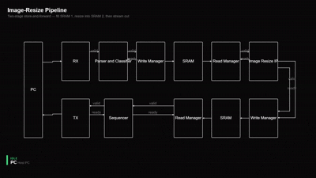
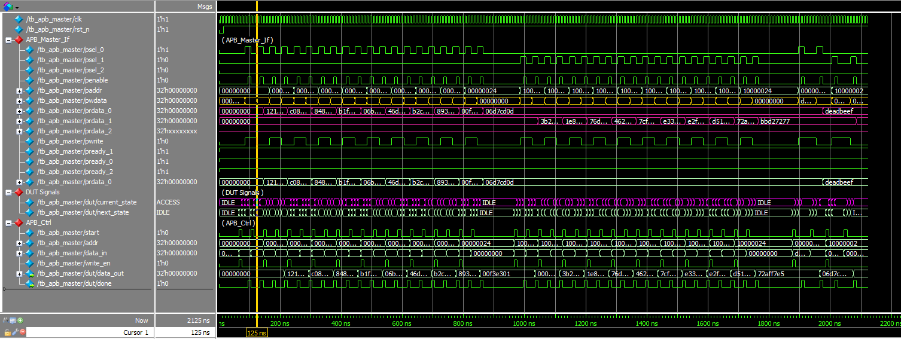
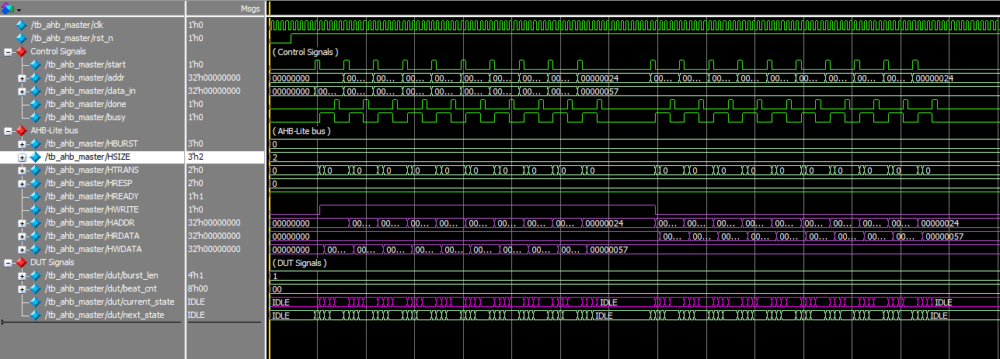

# Hi there! 👋 I’m Meitar Shimoni

I’m a **Hardware Engineer**,  
with a **B.Sc. in Electrical & Electronics Engineering**.  
I graduated from the **Chip Design & Verification Program** at **Google & Reichman Tech School**.

I enjoy designing **RTL and digital systems**, debugging complex issues, and continuously learning new technologies.

## 🚀 My Latest Work

- Full UVM Verification Environment Running for CPM DUT 

- Designed and verified an **APB Master and RGF Slave** for register-level control.  

- Designed and verified an **AHB-Lite Master (DMA-style)** for data streaming and memory access.  

## PROJECTS:

### VERIFICATION ENVIRONMENTS:
- CPM UVM VERIFICATION ENVIRONMENT.
- UART UVM VERIFICATION ENVIRONMENT.

### RTL/FPGA DESIGNS:
- IMAGE PRE-PROCESSING and POST PROCESSING with ARM CORTEX Processor.
- UART RGB IMAGE STREAMING PIPELINE.
- IMAGE CONVOLUTION PROCESSING MODULE.
- Ethernet RX/TX Module
